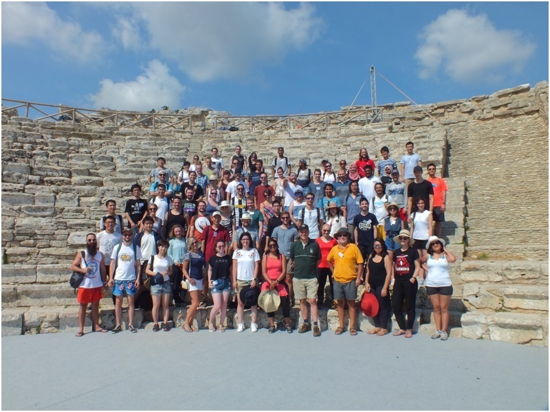

testing

# Конспекты курса machine learning
 
$$\int_\Omega \nabla u \cdot \nabla v~dx = \int_\Omega fv~dx$$
Also check out this [LaTeX introduction](https://en.wikibooks.org/wiki/LaTeX/Mathematics).

    
test

```
if (isAwesome){
   return true
}
```

If you want to insert images, this is how you do it:




still working on dogs and cats images classifiers

after initial testing I should. probably, start to use multiple class classifier instead of binary classifiers

still testing. problems with resnet50

снова начал работать с machine learning, че то тензорфлоу не поддается, пока закреплю machine learning. 

Надо попробовать использовать формы импульсов для достройки формы импульса. 

Хмм, надо как разделить данные тогда. Что-то должно быть дано и должно быть получено так ведь? 

А в формах импульса есть только сам импульс. Разве, что я могу порезать данные, но как это сделать?

Взять максимальное амплитуду и брать 50-70-90% от высота импульса и резать, или, скажем поднимать вверх
                                               
Что с этим лучше справиться? линейная регрессия?

16800 с чем то MAE, надо попробовать XGboost, вместо случайных деревьев. 
testing