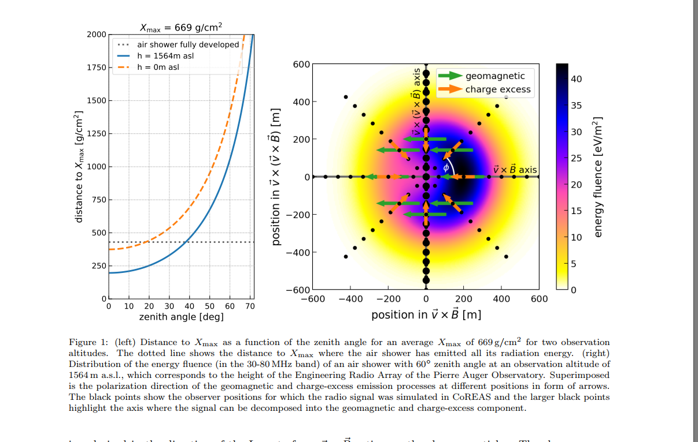
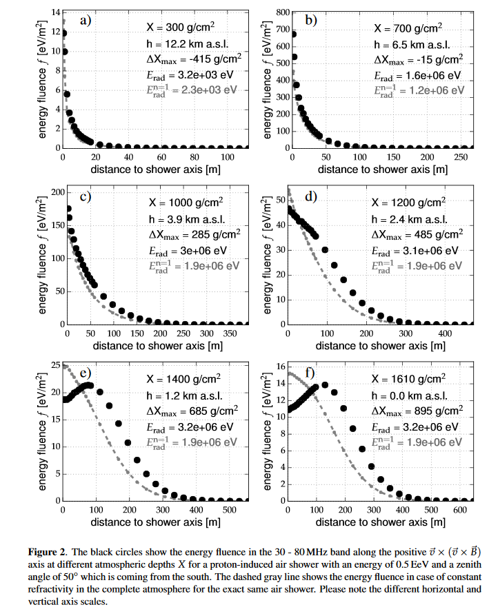
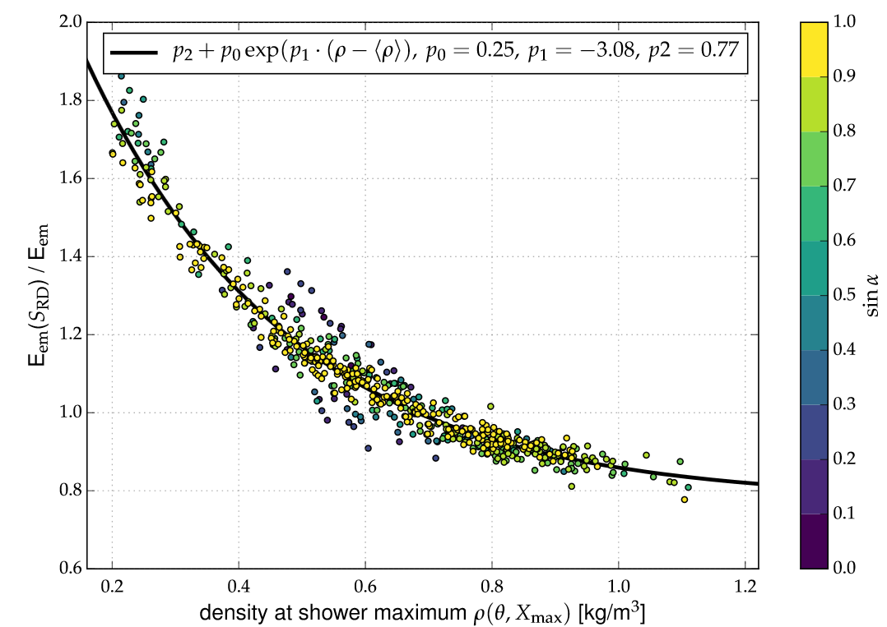

# An analytic description of the radio emission of air showers based on its emission mechanisms. 

**Абстракт.** Радиоизлучение ШАЛ несет очень важную информацию о параметрах КЛ, но основное ограничение это использование установок с небольшим количеством антенн, расположенных на большой площади. Такое расположение используется для большинства установок, т.к. это позволяет расширить получаемую информацию и финансово не очень затратно. Такая схема расположения антенн позволяет получить очень ограниченное число ливней высокого качества, что несколько уменьшает привлекательность данного метода. Авторы данной работы предлагаю новый параметрический подход для обработки событий по радиоданным, что позволит значительно увеличить точность измерений и уменьшит затраты времени на моделирование, как это, например, используется для установок с более густым размещением антенн ([[LOFAR]]). 

Радиоизлучение возникает из-за аккселеряции и рождения заряженных частиц в ливне, который описывается классической электродинамикой. На практике, только позитроны и электроны вносят вклад в электромагнитное излучение, вклад других пренебрежимо мал из-за малого отношения заряд/масса. С макроскопической точки зрения за генерацию радиоизлучения ШАЛ отвечают два механизма: геомагнитный и избыток заряда (Аскарьяновский). В доминирующем геомагнитном механизме, позитроны и электроны отклоняются под воздействием магнитного поля Земли (силы Лоренца) в противоположные направления, при котором возникает поперечный ток. Сила излучения пропорциональна \sin{\alpha}, синусу угла между направлением движения частиц ливня **v** и силовыми линиями магнитного поля Земли **B**. В другом механизме изменяющийся во времени отрицательный избыток заряда во фронте ливня вызывает продольный ток, который возникает в основном из-за возбуждения молекул воздуха. 

Пространственное распределение плотности энергии, т.е. энергии на единицу площади радио сигнала электрического поля, содержит такую информацию о ливне, как глубина максимума развития Xmax. Полная энергия излучения радиоизлучения, которая называется энергией излучения, может быть определена, как интеграл плотности энергии. Энергия излучения связана э/м энергией ливня Eem и позволяет с большой точностью (теор. точность ~3%) оценить энергию ливня. 

Форма пространственного распределения зависит в основном от Dxmax - расстояния от наблюдателя до района излучения. Район излучения может быть примерно определен положением Xmax. Величина Dxmax в основном зависит от зенитного угла \theta и примерно пропорционален Dxmax $\propto$ 1/\cos{\theta}. 

**Параметризация показанная здесь, позволяет быстро генерировать ожидаемые результаты в радиодетекторах. Начиная от типа и энергии приходящего ливня и выбора [[Xmax]] и направления прихода, сигналы антенн могли быть предсказаны для каждого положения антенны относительно оси ливня исходя из простой геометрии.**
- ## Monte Carlo dataset.
  
  300 ливней сгенерированны на CoREAS 7.5602 QGSJetII-04 (для высокоэнергетичных взаимодействия) и URQMD (для малоэнергетичных взаимодействий).
	- Геомагнитное склонение -35.9, а сила м.п. 0.24 Гс, которое соответствует установке Пьера Оже в Аргентине.
	- 10^{-6} Сининг
	- 250 кэВ порог низких энергий для электрон/позитронов и фотонов
	- атмосферные условия средние за октябрь на установке Пьера Оже, которые доступно на [[CORSIKA]] и соответствует среднегодовым условиям
	- 50% Fe и 50% p
	- E: 10^{17}-10^{19} - равномерно, как логарифм энергии
	- \theta от 0 до 60, по \cos{\theta}
	- азимут выбирался случайно. 
	  
	  Для анализа использовалась система координат плоскости ливня. 
	  Антенны расположены в виде звезды, по координатам плоскости ливня проэцированном на землю. [[shower_axis]] 
	  Сигналы ограничены 30-80 МГц фильтром. 
	  
	  $$f_{geo}(r)=f_{v\times B}(r,\phi=90^{\circ})=\varepsilon_{0}c\Delta t\sum_{i}E^{2}_{v\times B}(r,\phi=90^{\circ},t_{i})$$
	  
	  $$f_{geo}(r)=f_{v\times(v\times B)}(r,\phi=90^{\circ})=\varepsilon_{0}c\Delta t\sum_{i}E^{2}_{v\times(v\times B)}(r,\phi=90^{\circ},t_{i})$$
	  
	  где $$\varepsilon_{0}$$ - диэлектрическая проницаемость вакуума, c - скорость света в вакууме и $$\Delta t$$ - интервал выборки напряженности электрического поля E(r,t)
- ## Форма распределения сигнала
  
  Форма пространственного распределения сигнала зависит от расстояния между наблюдателем и районом излучения. Мы назовем его [[Dxmax]] и будет измерять его в г/см2 вдоль оси ливня. На рис. [[typical_shapes_ldf]] видны три основные формы ФПР. Первый случай - это когда ливень развился до Земли до того, как излучил все излучение (99% излучено), для таких ливней [[Dxmax]] =430 г/см2 и форма ФПР напоминает гауссиан; второй случай - когда ливень полностью излучил, но не прошел достаточно большое расстояние, [[Dxmax]] =572 г/см2.
- [[typical_shapes_ldf]]
	- {:height 439, :width 632}
		-
- Несмотря на весьма показательную форму ФПР на данном рисунке, следует иметь в виду, что у остальных ливней форма ФПР была другая. (вариант С)
  У некоторых левое плечо ФПР было выше по амплитуде, у других не наблюдалось такой большой разницы. Или как в варианте А, не у всех
  ливней возникает такой острый пик, у других он слегка смещен. 
  Вероятно, весьма значительный вклад вносит и флуктуации ливень-ливень в ФПР, но т.к. данная работа не ориентирована на исследование
  флуктуаций, мы не будем углубляться в это.
- ## Использование г/см2 для описания [[Dxmax]] 
  Есть два варианта измерения Dxmax: использовать граммах (г/см2) или геометрическую размерность (км). Развитие ливня и распространение радиоизлучения зависит от плотности воздуха, которую геометрическое расстояние не описывает. Для полноты картины при измерении в км надо использовать зенитный угол, т.к. при вертикальном и при наклонном ливнях черенковское кольцо будет иметь разные размеры, что влияет на поведение
  радиоизлучения на уровне земли. Конечно, использование г/см2, также, имеет недостатки, например, расстояние [[Dxmax]] не соответствует [[Xmax]] 
  а характер пространственного распределения, также зависит от [[Xmax]] . Для полной картины необходимо учитывать, как [[Xmax]] и [[Dxmax]] .
- Рисунок 1
  collapsed:: true
	- 
- Рисунок 2
  collapsed:: true
	- 
- Рисунок [[Res_dens]].
	- 