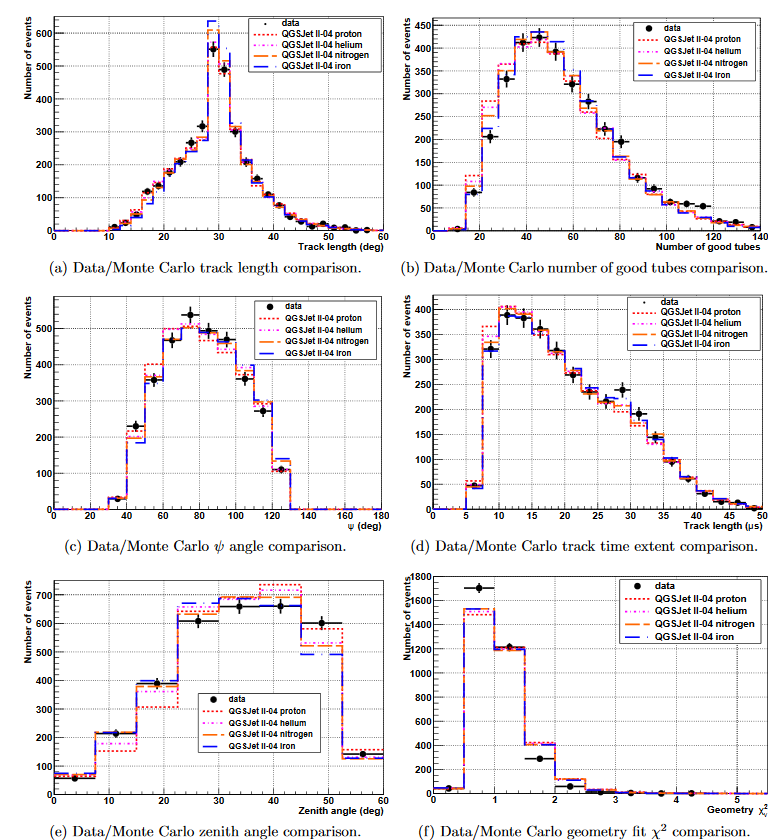

# Data/Monte Carlo Comparison
#konspekty 
Для прямого сравнение сгенерированных по методу Монте-Карло (МК) и экспериментальных данных надо привести сгенерированные данные к тому же виду, что и экспериментальные данные, и хранить их в том же виде. Такой подход позволяет лучше понять детектор сравнивая с моделированием и использовать моделирование по МК для сравнения с разным составом моделей и т.п. #simulation 

Таблица 1
```
--------------------------------------------------------------
             proton       helium      nitrogen    iron
             bias res.   bias res.    bias res.   bias res.
_______________________________________________________________
Xmax(g/cm2)    -1.1 17.2  -3.3 15.7    -3.8 14.2   -3.8 13.2
Energy (%)      1.7 5.7   -1.1 5.1     -3.5 4.4    -6.5 3.9
theta (deg)   0.01 0.4    0.06 0.4      0  0.3      0   0.3 
phi (deg)    -0.02 0.4   -0.02 0.4   -0.02 0.4      0   0.4
psi (deg)     0.07 0.4    0.09 0.4    0.11 0.4     0.14 0.4
Rp (m)        18.9 38.8   20.1 39.0   21.1 38.9    22.3 37.7
X  (m)        -3.6 49.8   -3.4 49.9   -3.3 50.6    -3.7 51.9
Y  (m)        8.7  42.9    8.1 42.3    8.3 42.9     8.4 43.3
--------------------------------------------------------------
```

**Число сгенерированных данных должно быть больше, желательно намного больше, в крайнем случае, если экспериментальных данных очень много, то такое же число данных.** 

Как показано в табл. 1 в нем приведены два типа данных: bias и res. --- resolution. [[bias]] --- вычисляется как среднее значение распределения Xrecon - Xtrue, где Xrecon --- это величина восстановленная по тому же принципу, что и реальные (экспериментальные) данные, Xtrue --- это истинное значение величины, которое заложено при моделировании. [[res.]] --- вычисляется как среднеквадратичное отклонение ([[standard deviation]]) смоделированных данных.
- Рисунок
	- 