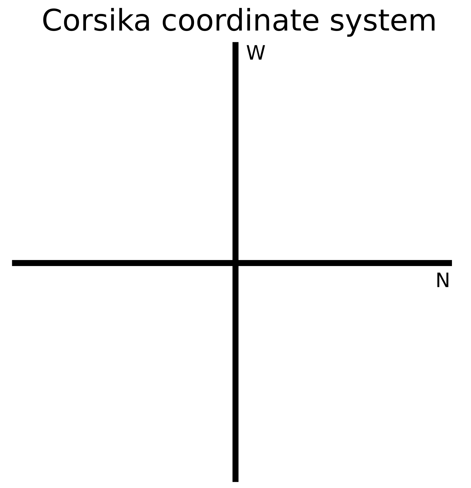

-
- ### An analyttic description of the radio emission of air showers based on its emission mechanisms
  tags:: [[AERA]] [[radio_emission]] #simulation 
  author:: [[AERA]] 
  type:: [[article]]
  link:: https://arxiv.org/abs/1806.03620
  [[Analytic_approach]]
-
- ## CORSIKA
	- Система координат на [[CORSIKA]]
		- {:height 513, :width 504}
-
- ## Заметки о моделировании
	- [[data_MC comparison]]