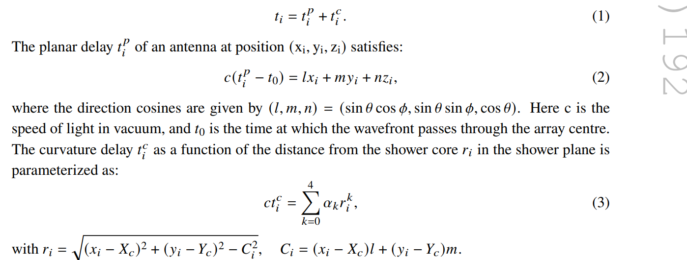
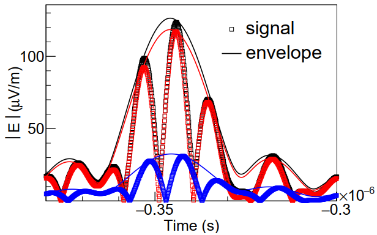

- Использовалась библиотека сгенерированных ливней ЛОФАР. Надо было восстановить компоненты э.п. E_\theta и E_\phi для частоты 20-80 МГц.
- Набор данных включал 24000 протонных и 13000 железных событий с зенитными углами от 0 до 40 и энергиями 10^17-10^18 эВ. Оси всех ливней находились в центре установки.
- Полный сигнал на каждой антенне использовался для определения прихода и лоцирования ливня, далее сигнал разлаживали на геомагнитную и аскарьяновскую компоненты. Для дальнейшего анализа использовалась только геомагнитная компонента т.к. она составляет 80 % от общего сигнала и является более симметричной в отличие от аскарьяновской.
- 
- здесь, Xc, Yc - это ось ливня
- 
- 20 ns - в таком окне берется интеграл сигнала для определения флюенса.
-