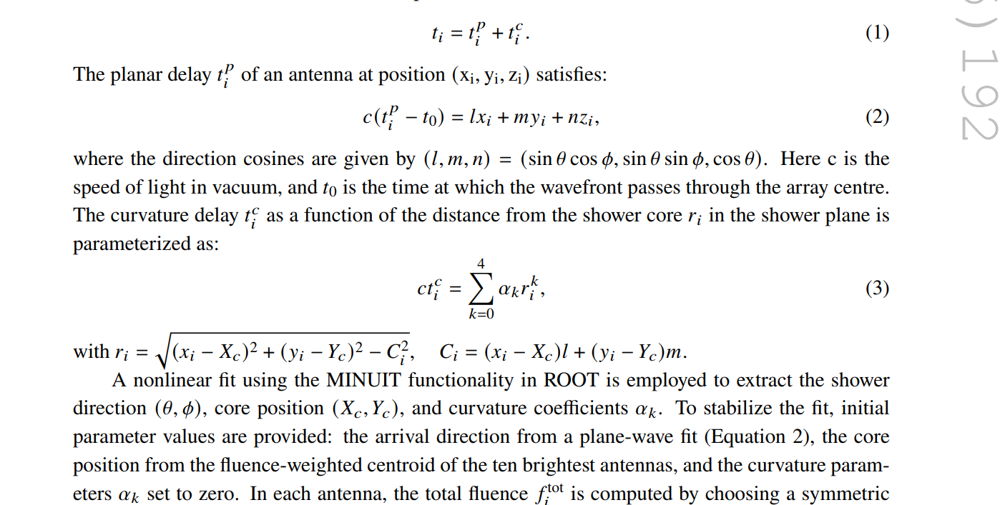
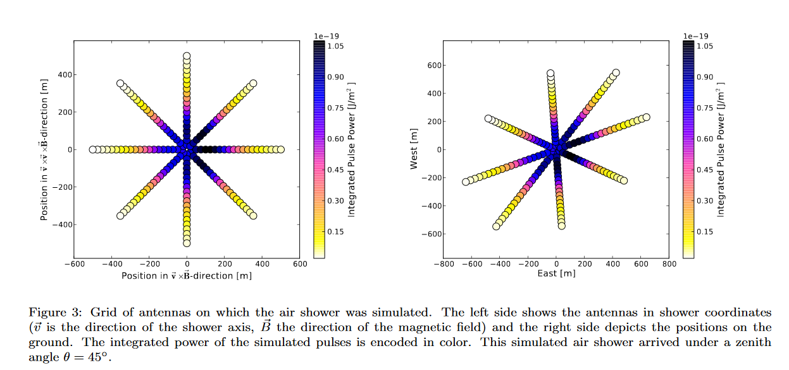
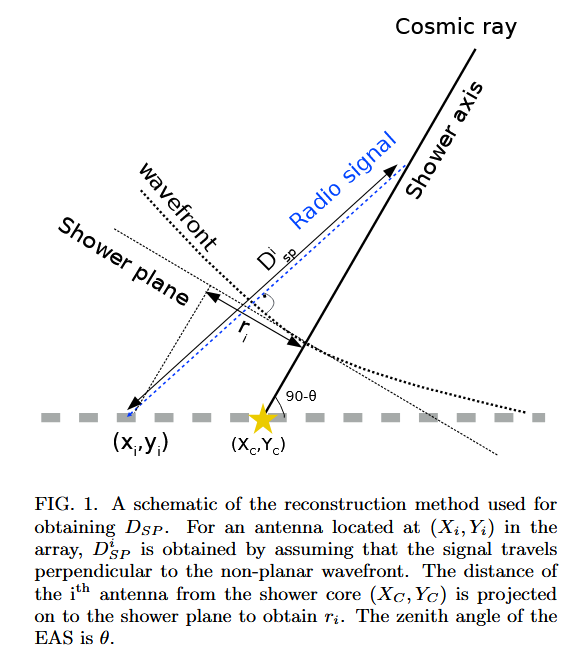
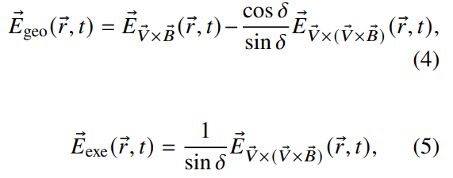
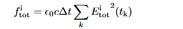
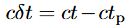
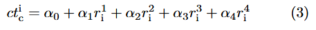

- Использовалась библиотека сгенерированных ливней ЛОФАР. Надо было восстановить компоненты э.п. E_\theta и E_\phi для частоты 20-80 МГц.
- Набор данных включал 24000 протонных и 13000 железных событий с зенитными углами от 0 до 40 и энергиями 10^17-10^18 эВ. Оси всех ливней находились в центре установки.
- Полный сигнал на каждой антенне использовался для определения прихода и лоцирования ливня, далее сигнал разлаживали на геомагнитную и аскарьяновскую компоненты. Для дальнейшего анализа использовалась только геомагнитная компонента т.к. она составляет 80 % от общего сигнала и является более симметричной в отличие от аскарьяновской.
- 
- здесь, Xc, Yc - это ось ливня
- 20 ns - в таком окне берется интеграл сигнала для определения флюенса.
- 
	- Рис. 1. антенны установлены следующим образом. 400 антенн с расстоянием 20 м между ними расположенные в квадрате 400 м х 400 м
- The signals were generated in a time window of 480 ns, with a resolution of 0.1 ns
	- это стандарт для кореаса?
- Метод сделан в предположении, что излучение распространяется перпендикулярно к фронту радиоволны.
- 
- От каждой антенны строится прямая линия, которая должна пересекать фронт волны перпендикулярно и достичь до оси ливня. Это и будет точка излучения.
- As in real data, output from CoREAS simulation gives the total radio
  signal at each antenna
	- 
	- затем эти сигналы разделяются на геомагнитный и Аскарьяновский. Здесь надо иметь в виду, что Evx(vxB) и EvxB - совпадают с двумя горизонтальными компонентами, которые дает CoREAS. При условии, что антенны расположены вдоль силовых линий.
- флюенс считается вот так 
- 
	- Тут надо иметь в виду, что интегрирование бралось по самой форме сигнала, а не результат преобразование Гильберта.
	- Здесь красный это геомагнитная составляющая, синяя - Аскарьяновская, а черная это результирующая. Кривыми показано преобразование Гильберта
- После лоцирования и разделения сигнала на компоненты идет восстановление продольного развития радиоизлучения по геомагнитной компоненте сигнала.
	- Перед этим происходит уточнение лоцирования, но теперь только по геомагнитной компоненте. Разница в 0.01 (geo) и 0.05 (total).
	- это уменьшает ошибки лоцирования на 4 метра
- Используя полученные координаты оси и направления прихода, строится фронт волны геомагнитного излучения  как функция от r, как показано на рис. 7 (a)
	- Здесь t_{p} - это разница между временем прихода фронта ливня и срабатыванием антенны (propagation delay of the shower plane)
- 
	- рис. 7 (а) - задержка времени как функция от расстояния до оси ливня на плоскости ливня. Черной кривой показан полиномиальный фит 
- В определенной точке берется производная формулы (3) и она показывает наклон фронта волны.
- Следующий шаг: определяется эффективный источник для каждой антенны на оси ливня (FIG 1). Это получается построением прямой от антенны до оси, которая проходит перпендикулярно через фронт волны. Для упрощения проверка на перпендикулярность проводится 1 раз для антенн находящихся в радиусе 2 м друг от друга на плоскости ливня. Таким образом строится рисунок b.
- Затем это расстояние конвертируется в глубину атмосферы X согласно модели GDAS.
- Считая, что радиоизлучение ШАЛ узконаправленное (распространяется в узкой телесном угле), геомагнитное излучение (S^{i}_{geo}) зависит от флюенса (f^{i}_{geo}) и квадрата расстояния от антенны до источника излучения (D^{i}_{SP}). В то же время (S^{i}_{geo}) пропорционально квадрату полного числа электронов и позитронов (N^{2}_{e}) ШАЛ (что дает возможность сравнить Xmax для электронов и позитронов с Xmax по радиоизлучению). На рисунке (c) показано зависимость (S^{i}_{geo}) от X. (d) здесь по бинам разложено, размер бина 26 г/см2.
- Разница между гильбертом и настоящей формой импульса авторы объясняют тем, что гильберт недостаточно точно описывает форму импульса, что приводит к смещение, который только увеличивается с ростом расстояния от оси ливня. Т.е. это не связано с неправильным лоцированием.
-
-
- Reconstruction of EAS radio emission profile using geomagnetic signal
- ВОПРОСЫ:
	- им амплитуда получается не нужна? зачем разделяли на геомагнитную? что с ней делали?
		- они ее используют, чтобы определить время. Т.е. время t_{i} берется тогда, когда амплитуда достигает максимума!
		- Для полного сигнала и геомагнитного сигнала они отличаются.
	-