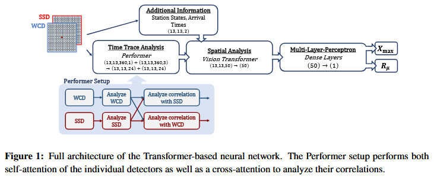

- DNN был использован для извлечения информации с измерений наземных детекторов Оже Прайм. DNN состоит из двух частей, первая часть работает с сигналом станций, а второй отпечатком ливня на плоскости. Похожий способ ранее использовался в RNN совместно с CNN для определения глубины
  максимума развития Xmax [^1][^2].
  Здесь RNN и CNN заменены attention-based Transformers и Rмю – число мюонов без зависимости от энергии и зенитного угла (берется из моделирования). Установка разбита на шестиугольные клетки для удобства определения отпечатка ливня и анализируется Vision Transformer[^3],
  который обычно используется в image recognition.
- [^1] - A. Aab et al. [Pierre Auger coll.], JINST 16 (2021) P07019. [[Aug 29th, 2025]]
- [^2] - J. Glombitza et al. [Pierre Auger coll.], PoS ICRC2023 (2023) 278.
- [^3] - A. Dosovitskiy et al., Internation Conference on Learning Representations (2021)
- **Preprocessing.** Для  начала надо подготовить данные. На вход в DNN подаются данные с каждой станции: 3 - WCD импульсы; 1 - SSD импульс; время прихода первой частицы; состояние станции. Препроцессинг такой же как в [^1], но с небольшими добавками из-за SSD и увеличенной частоты дискретизации. Амплитуда импульсов WCD и SSD трансформируется по формуле:
- $$\tilde S(t) = \log_{10}(S_i(t)/VEM + 1)$$
- Далее, для нормировки эти значения делятся на СКО $\tilde S(t)$.
- Таким же образом нормируется время прихода.
- Так как DNN тренируется на симулированных данных, сигналы выше определенного уровня срезаются, чтобы сымитировать насыщение сигнала как в реальных данных.
- Дополнительно небольшая доля ФЭУ и станций случайным образом выставлены на 0, чтобы сымитировать не работающие или несуществующие станции и ФЭУ. Информация работоспособности станций подается в DNN 1 или 0.
- **Time Trace Analysis**. В первой фазе DNN, Performer используется для совместного анализа наземных детекторов для каждой отдельной станции, тем самым уменьшая отклики (traces) до 24 характеристик каждый. Performer позволяет обрабатывать длинные последовательности из 360 шагов. Дополнительно это позволяет оценить два разных типа откликов (self-attention) и их корреляцию (cross-attention). DNN только для водных баков обучался двумя последовательными self-attention.
- **Пространственный анализ слепка (footprint)**. Для пространственного анализа используется комбинация времени прихода и состояний станций, который подается в видел вектора из 50 значений на каждую станцию (наверное, чтобы из вектора составить матрицу). Self-attention для всех станций осуществлен при помощи Vision Transformer, где DNN преобразует геометрические данные через Эмбеддинги (это процесс преобразования данных в векторы) для дальнейшего обучения. Затем, ливень преобразуется в 50 значений, которые получается путем усреднения по всем станциям.
- **Выходные данные нейросети**. Все эти данные подаются на вход двух отдельных перцептронов, которые обрабатывают 50 значений всего ливня и выдают Xmax и Rмю[^4]. Для обучения используются полученные в ходе симуляции значения Xmax и Rмю.
- [^4] - R\mu число мюонов
- Loss-function given by an element-wise mean squared error.
- 
- ### Данные
	- Для обучения использовались 300000 сгенерированных ливней при помощи [[CORSIKA]] и модель адронных взаимодействий [[EPOS LHC]]  для разных первичных частиц. Дополнительно еще 56000 ливней было использовано для тестирования.
	- Диапазон энергий от 3 до 160 EeV с распределением E^{-1}
	- Диапазон углов с 0 до 65 градусов с распределением cos^{2}(\theta)
	-