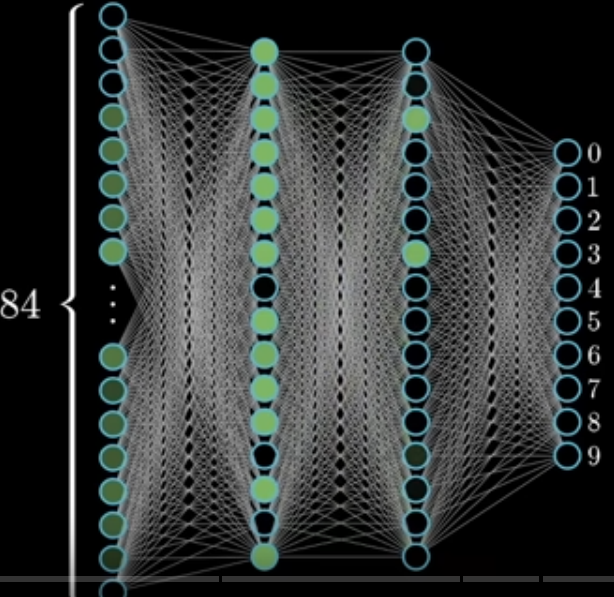

alias:: [[нейросеть]]

- ## Объяснение
	- здесь будет приводиться простое объяснение что такое нейросеть
- ### Что такое нейросеть
  collapsed:: true
	- Нейросеть используется для разных задач. Для этого используются разные модели.
	- Например CNN (convolutional neural network) используется для распознавания изображений.
	- Long short-term memory network - для распознавания речи.
	- Простейшей нейросетью является персептрон (или многослойный персептрон). Который исторически был разработан для распознавания чисел.
	- {:height 242, :width 236}
		- рис. 1
	- Название нейроны связаны с клетками мозга. Но в данном случае надо это представлять как простой **объект хранящий число** (от 0 до 1).
		- Это число внутри нейрона называется **активацией**
		- Представьте, что нейрон загорается при увеличении активации (чем ближе к 1)
	- Для рис. 1 первой слой, состоящий из 784 (28х28) нейронов будет называться первым слоем. Последний слой будет состоять из 10 нейронов, где каждый нейрон отвечает за определенное число (от 0 до 9). Их активация это соответствие тому или иному числу.
	- Слои между 1-м и последним слоем это скрытые слои.
	- Но как работает нейросеть?
		- Слои и нейроны в нем отвечают за определенные закономерности
		- Например, 9 можно разделить на окружность и линию. 8 - на две окружности, 4 - это вертикальная, диагональная и горизонтальные линии. и т.д (на самом деле эти числа можно разделить и на еще большее число компонент, но для простоты будем считать так).
		- Для связи между слоями используются веса, они определяют важность тех или иных нейронов для конечного результата. Но на выходе мы должны получить значение близкое к 1, поэтому надо использовать сигмоидную функцию или ReLu.
		- $$\sigma(x) = \frac{1}{1+e^{-x}}$$
		- Здесь \sigma это функция, а x = (w_{1}a_{1}+w_{2}a_{2}+...+w_{n}a_{n} - b),
		- где w - это вес, a - активация, b - смещение (bias)
		- это только для одного нейрона, а для все сети, лучше представлять это в виде матрицы.
		- В нашем случае таких параметров будет 13002 (784*16 + 16*16 + 16*10 [это веса] + 16+16+10 (bias))
			- Для мысленного эксперимента представьте, как вы будете вручную подбирать все эти параметры.
		- Всегда полезно представлять каким образом веса и смещения себя ведут. Это позволяет лучше представлять решение и быстрее находить способы его оптимизации.
		- использование матриц проще и быстрее. К тому же вычисления на компьютере производятся в виде матриц, для повышения быстродействия.
		- $$\sigma\left(\left[\begin{array}{cccc} w_{0,0} & w_{0,1} & ... & w_{0,n} \\ w_{1,0} & w_{1,1} & ... & w_{1,n}\\ ...& ... & ... & ... \\ w_{k,0} & w_{k,1} & ... & w_{k,n}\end{array}\right] \left[ \begin{array}{c} a_{0}^{(0)} \\ a_{1}^{(0)} \\ ... \\ a_{n}^{(0)}\end{array}\right] + \left[ \begin{array}{c} b_{0} \\ b_{1} \\ ... \\ b_{n}\end{array}\right]\right)$$
		- ML сильно связан с линейной алгеброй. Правильнее рассматривать каждый нейрон как функцию, которая принимает на вход все предыдущие нейроны и выдает значение от 0 до 1. Вообще, в широком смысле, вся нейросеть это функция.
		-
	-
- ### Градиентный спуск. Как обучается нейросеть
  collapsed:: true
	- Для обучения нейросети используется очень большое количество количество правильно помеченных данных, т.е. в случае если мы имеем дело с цифрами написанными от руки, нами же давались бы точные данные о том, что это за цифра. Более того, нам нужна небольшая часть данных, которые наша модель никогда не видела, которая будет работать как тестовые данные для проверки точности работы нашей модели. Потому что модель может "переобучиться", т.е. вместо того, чтобы найти правильные паттерны, которые отвечают за правильное решение задачи, просто "запомнит" некую последовательность. В каком-то смысле это как запомнить таблицу Сивцева (для проверки зрения) и отвечать по памяти, когда медсестра указывает на букву, вместо того, чтобы читать видя глазом.
	- Но тут встает вопрос, каким образом мы оценим обученность модели. Как мы будем обучать нашу модель.
		- Для этого используется функция стоимости. Которая дает численное значение ошибки. Чем меньше это значение тем точнее модель. Для его расчета мы берем квадрат разности между выходными данными и ожидаемым значением и слагаем их с друг другом.
		- К примеру, на вход мы подали 3. На выходе получили 0 = 0.43, 1 = 0.28, 2 = 0.19, 3 = 0.88 и т.д. Тогда,
		- $$Cost(3) = (0.43 - 0)^2 + (0.28 - 0)^2 + (0.19 - 0)^2 + (0.88 - 1)^2 + ...$$
			- Как видно эта функция будет тем больше, чем сильнее ошибается наша модель. В идеале, она должна везде давать 0, а на 3 давать 1, тогда функция стоимости будет равна 0.
	- **Очевидно, обучение модели это есть минимизация функции стоимости**. Но как это сделать? Для этого используется отрицательный градиент, который рассчитывает значения для всех нейронов модели на сколько надо изменить веса для уменьшения функции. При этом размер шага зависит от значения градиента, а направление от знака. Таким образом находится локальный минимум.
	- Для простоты мы представляли, что второй слой ищет линии или кусочки линий, которые в третьем слое использует для поиска паттернов. На самом деле, реальная нейросеть так не работает!
	- Если мы рассмотрим как выглядят веса (т.е. для рисунка 28х28) это не будет похоже ни на что, вряд ли там будем хоть какая-то закономерность, мы не сможем увидеть ни линий, ни окружностей, ни их каких-то частей.
- ### Backpropagation. Обратное распространение
  collapsed:: true
	- обратное распространение нужно для обучения модели. Функция стоимости дает значение для каждого y (до суммирования), поэтому это позволяет рассчитать градиент. Градиент это значение на которое нужно уменьшить веса для получения нужного результата. Только градиент берется для всех примеров и усредняется. Т.к. такой расчет идет с последнего слоя к 1-му он называется обратным рапространением (backpropagation).
	- из-за большого количества данных, обучение на всех входных данных будет слишком трудоемки. Поэтому используется метод, который называется стохастическим градиентным спуском. Суть метода заключается в том, чтобы перемешать все данные случайным образом и разбить их на мини-батчи по 100 штук. Далее эти мини-батчи подаются для обучения, каждый шаг градиент выполняется после 1-го батча. Это не совсем то, что можно было бы получить каждый раз прогоняя по всем данным, но достаточно близко, и основная мотивация это оптимизирует время обучения.
	- Итак, подытожим, backpropagation это алгоритм для определения того, как одно обучающее изображение хочет изменить веса и смещения, чтобы максимально уменьшить функцию стоимости. Остальные изображения дают свои пожелания и они усредняются. Полноценный шаг градиентного спуска потребовал бы все изображения, но для ускорения вычисления мы разбиваем наши изображения на мини-батчи и вычисляем каждый шаг на мини-батчах. Мы будем делать такие шаги снова и снова, в итоге мы придем к локальному минимуму функции стоимости и наша модель будет давать более-менее точный результат.
- ### Backpropagation - 2.
  collapsed:: true
	- Давайте для простоты представить простую нейросеть, где в каждом слое будет по-одному нейрону активации.
	- ```
	                       L
	  o   -   o  -  o   -   o
	             a(L-1)    a(L)
	  ```
	- в таком случает функция стоимости C_{0} = (a^{(L)} - y)^{2}
	- a^{(L)} = \sigma(w^{(L)}\cdot a^{(L-1)} + b^{(L)})
	- Для упрощения примем z^{(L)} = (w^{(L)}\cdot a^{(L-1)} + b^{(L)}), тогда
	- a^{(L)} = \sigma(z^{(L)})
	- Такое отношение мы можем представить в виде цепочки отношений. Т.е. w^{(L)}, a^{(L-1)}, b^{(L)} от которых зависит z^{L}. Из z^{L} получаем a^{L} - активацию. В свою очередь из a^{L} и y получаем C_{0}.
	- Т.к. все эти параметры по сути цифры, проще представлять их как взаимосвязанные ползунки, изменение которых влияет на C_{0}. Или представить в виде дифференциала $$\frac{\partial{C_{0}}}{\partial{w^{L}}}$$. Другими словами нам интересна связь w^{L} с C_{0}.
	- $$\frac{\partial{C_{0}}}{\partial{w^{L}}} = \frac{\partial{z^{L}}}{\partial{w^{L}}}\frac{\partial{a^{L}}}{\partial{z^{L}}}\frac{\partial{C_{0}}}{\partial{a^{L}}}$$
	- подставляем значения частных производных и получаем:
	- $$\frac{\partial{C_{0}}}{\partial{w^{L}}} = \frac{\partial{z^{L}}}{\partial{w^{L}}}\frac{\partial{a^{L}}}{\partial{z^{L}}}\frac{\partial{C_{0}}}{\partial{a^{L}}} = a^{(L-1)}\cdot\sigma ' (z^{(L)})\cdot 2(a^{(L)}-y)$$
	- Не надо забывать, что это функция стоимости **только 1 изображения** поэтому их надо усреднить на все данные n (или на размер батча):
	- Для более сложной модели (с большим количеством нейронов в слое) все будет выглядеть примерно так же.
	-
- ### Transformers
  collapsed:: true
	- Наверное самым популярной моделью использующей трансформеры является GPT. Generative Pre-Trained Transformer (Генеративный Предварительно тренированный Трансформер), который использует модель Трансформер, который позволяет и является причиной бума ИИ.
	- Трансформер это очень сложная модель которая оперирует Attentnion Block, который позволяет сохранять контекст данных, которые должны зависеть друг от друга. По сути, это небольшая часть данных внутри матрицы, которая коррелирует с друг другом, из-за чего изменение внутри них происходят одновременно.
	- Сама же модель представляет собой большое количество матриц, которые перемножаются с друг другом, а затем подаются на вход многослойного персептрона, а затем снова поступает на трансформер и так много раз.
	- Трансформер можно разделить на 4 этапа, которые происходят внутри него.
		- Embedding, Attention, MLPs, Unembedding
		- #### Embedding
		  collapsed:: true
			- Вообще, понятие embedding можно по-русски назвать токенизацией или предварительной обработкой данных. Для случая работы со звуком он включает разделение звуков на части, для рисунков разделение на клетки или пиксели (причем пиксели могут быть каких угодно размеров), для текста это разделение на части слов или целые слова. Для простоты мы будем считать что каждый токен является отдельным словом (хотя опять же подчеркнем, что это не так, токен это часть слова или даже один слог).
			- Каждый токен можно представить в виде многомерного вектора, который также можно для простоты представить в виде трехмерного вектора. При таком упрощении есть возможность визуализировать вектора в пространстве. Если мы рассмотрим слова похожие по смыслу, они будут лежать очень близко в пространстве, например башня, небоскреб, высотка и т.п. они все будут лежать рядом. Также, такие слова как мужчина и женщина тоже будут лежать рядом, но между ними будет достаточное расстояние, которое и есть различие пола. Т.е. Король и Королева, даже если они будут лежать в противоположном от мужчины и женщины расстоянии они будут друг от друга примерно на таком же расстоянии что и мужчина и женщина. Т.е. если запишем это математически:
				- Мужчина - Женщина = Король - Королева.
			- Тут заметим, что в реальности они не равны, но это вызвано нашей культурой, потому что Королева это не всегда женская версия Короля (особенно это касается английского языка с такими словами как Drag Queen и т.п.).
			- Также, если мы возьмем слово Гитлер и вычтем из нее Германию и прибавим Италию, то получится Муссолини (по крайней мере очень близко). Т.е. модель понимает, что между Гитлером и Муссолини разница только в том, что они из разных стран. При этом Гитлер и Муссолини будут в одной стороне, а Италия и Германия в другой, т.е. это в модели задается направлением вектора.
		- #### Unembedding
			- Здесь берется последний вектор, и сравнивается со словарем, чтобы получить вероятность появления того или иного слова, который трансформируется с вектора путем нормализации (функции softmax)
				- softmax используется для того, чтобы получить на выходе сумму значений вероятностей, которая должна давать 1, при этом значения должны находиться между 0 и 1. Но в случает машинного обучения у нас получатся значения от -5 до +5 (или каких то других значений, которые не лежат между 0 и 1) и их сумма точно не даст 1. Для этого и используется softmax.
				- Получается, что softmax это функция которая превращает любой набор чисел в вероятность, которая в сумме дает 1. При этом самое большое число в наборе будет ближе к 1, а самое меньшее ближе к 0. Математически это выглядит вот так:
				- пусть у нас есть набор чисел записанных в матрицу x1, x2, ... xn. Мы возьмем экспоненту для каждого числа e^{x1}, e^{x2}, ... e^{xn}, что даст нам значения больше 0. Далее полученные значения суммируются и мы получаем $$\sum^{N-1}_{n=0}e^{xn}$$. И все значения e^{x1}, e^{x2}, ... e^{xn} делятся на полученную сумму, что дает нам вероятности от 0 до 1.
			- Также, надо упомянуть, что есть softmax with temperature T. Это такой знаменатель на который делятся все значения x1,x2,x3.. xn. Т.е. мы получим e^{x1/T}, e^{x2/T}, ... e^{xn/T}, такой подход используется в чат ГПТ и тому подобных чат ботах, для того, чтобы промпт каждый раз давал разные результаты. При T >> 0 (когда стремится к большим числам), вес будет больше у меньших чисел, а при T = 0, вес будет больше у больших чисел. В генеративных ИИ температура выставляется между T= 0 и 2.
	- Специалисты по ИИ обычно называют значения x1,x2,... xn, которые подаются на вход в функцию softmax logits, а выход probabilities.
	-
	-