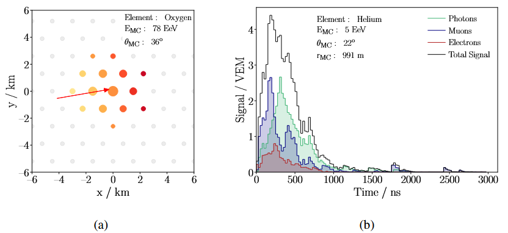

- Рис.1
	- 
		- а) сгененированный паттерн сигнала наземных детекторов. Размеры пятен указывают на величину сигнала и цвета означают время регистрации ливня станцией (желтый = рано, красный = позже). Стрелка это проекция оси ливня на плоскость установки и центр диска;
		- б) Сгенерированный сигнал события ШАЛ измеренный наземным детектором на расстоянии ~1000 м от оси. Разные цвета означают разные компоненты ливня.
- Отпечаток ШАЛ состоит из характерных паттернов (рис. 1а), которые представляют собой наземные станции расположенные в гексакональных клетках. Каждая станция выдает развертку сигналов от трех ФЭУ. Пример сгенерированного сигнала показан на рис. 1б.
- Основная идея это на вход нейросети подать необработанные данные события ШАЛ. Такие данные состоят из трех сигналов, местоположения станции и времени прихода первой частицы на станцию.
- Очень важен процесс подготовки данных для обучения. К примеру, для обучения модели гораздо лучше, если размерность данных будет примерно одинаковой. Поэтому нужно амплитуды и время сигналов нормировать. А еще необходимо учитывать реальные условия работы установки.
- Для генерации данных использовался пакет CORSIKA 7.6400.
- для генерации откликов детекторов использовался ПО Pierre Auger Offline[^1], который написан на основе GEANT4.
- [^1] - [ссылка](https://arxiv.org/abs/0707.1652)
-