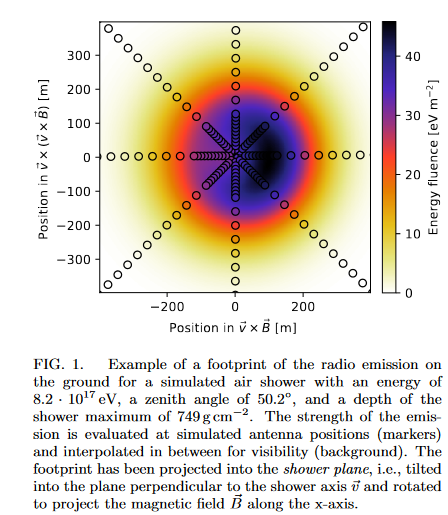

Плоскость ливня это плоскость перпендикулярная стволу ливня (вектору v). 

Т.е. получается, что у нас по OX совпадает с направлением вектора магнитной индукции B. А OY перпендикулярен этому вектору и вектору v, т.е. совпадает с направлением силы Лоренца (вроде как, надо бы проверить, про это не писал Костюнин в своей диссертации?). 

Сами детекторы/наблюдатели, будут наклонены под углом равным зенитному углу к стволу ливня и расположены так, что ось OX должна совпадать с вектором магнитной индукции, а OY с силой Лоренца.

	- 